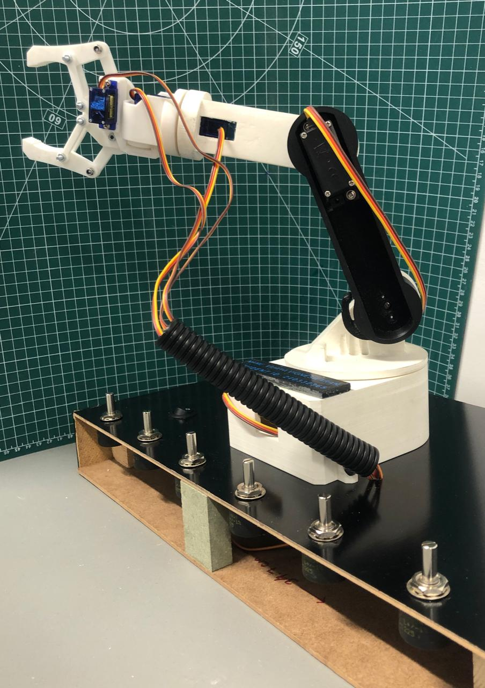

# surgical-robotic-arm
6-DOF robotic arm for surgical applications — ROS2, Python, Arduino | MSc Robotics, Aston University
# 6-DOF Robotic Arm for Surgical Applications

**MSc Robotics and Autonomous Systems — Aston University (2025)**

A fully functional 6-degree-of-freedom robotic arm designed for surgical precision environments, achieving sub-millimetre positional repeatability. Built as my MSc capstone project — the arm works and moves.

---

## What It Does

- Moves all 6 joints independently with precise position control
- Accepts target positions and calculates joint angles automatically using inverse kinematics
- Controlled wirelessly via Bluetooth for manual operation
- Runs autonomously using a ROS2-based motion planning pipeline

---

## Tools & Technologies

| Area | Tools Used |
|------|-----------|
| Mechanical Design | SolidWorks, Autodesk Fusion 360 |
| Control Software | ROS2 (nodes, topics, launch files) |
| Programming | Python (inverse kinematics, motion planning) |
| Hardware | Arduino, Servo motors, Bluetooth module |
| Operating System | Ubuntu / Linux |

---

## How It Works

**1. Mechanical Structure**
Designed 6 joints and links in SolidWorks to balance workspace reach, structural rigidity, and minimal vibration. Each joint is driven by a servo motor selected for controllable torque and speed.

**2. Inverse Kinematics (Python)**
Given a desired position for the end-effector (the tip of the arm), the Python solver calculates what angle each of the 6 joints needs to be at. This is the core maths that makes precise positioning possible.

**3. ROS2 Control Architecture**
ROS2 manages communication between the motion planner and the hardware. Nodes publish joint commands, which are received by the Arduino controller and executed by the servo motors.

**4. Arduino Hardware Interface**
Arduino receives joint angle commands and drives the servo motors to the correct positions in real time.

---

## Project Status

✅ Arm fully built and operational  
✅ Inverse kinematics implemented and tested  
✅ ROS2 control pipeline working  
✅ Bluetooth manual control working  
✅ Repeatability: ±2mm measured over 10 cycles  
✅ Positional accuracy: ±4mm  
✅ Max payload: 75g  
✅ Bluetooth latency: ~120ms (wireless mode)  
✅ Wired control latency: <20ms

---

## About Me

Vijaya Vigneswaran — Robotics Software Engineer based in Birmingham, UK.  
MSc Robotics and Autonomous Systems, Aston University (Merit, 2025)  
3 years industry experience at Honeywell (aerospace mechanical design)  

📧 vijayavigneswaran@gmail.com  
🔗 [LinkedIn](https://www.linkedin.com/in/vijaya-vigneswaran)
